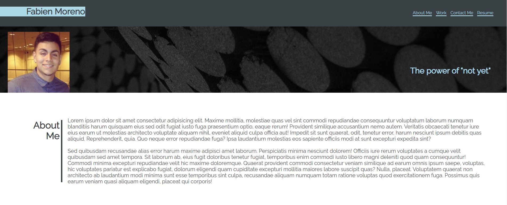

# challengetwo-portfolioproj

## Description

This is challenge two in the UT Austin Bootcamp. I created a portfolio displaying future projects to come and mini-projects that have already been completed. This is a project that will continue to receive updates as most of the future project thumbnails are clickable and have active links but will take you to my GitHub. As I continue through the course I will add a bigger work section as well as update the links to those projects as they are completed.

The purpose of this repository is to showcase current completed work in the course as well as the future content to come. Updates will be made available regularly along with improvements to these projects as I move forward in the course.

## Usage

The navigation will take you throughout the webpage sections (About Me, Work, Contact Me, and Resume) as selected. There is an opacity over the images indicating a hover effect as to provide clarity into the anchored element project you would like to select and view. Towards the bottom of the page you will see ways to connect with me as well as multiple ways to contact me. 

To view my Resume view the navigaton bar at the top to have a separate page view of a pdf including my previous work histry, skills, and accomplishments.

## Technologies

HTML,
CSS,
Advanced CSS (Flexbox)

## Credits

- Hero photo by Tobias van Schneider https://unsplash.com/@vanschneider?utm_source=unsplash&utm_medium=referral&utm_content=creditCopyText.
- Collaboration and Ideas with James Kelly https://www.linkedin.com/in/james-kelly-b93a94150/.
- Unsplashed for hero image https://unsplash.com/.

## Screenshots (Deployable Page Link)

Deployed Page https://fabien1313.github.io/challengetwo-portfolioproj/

## License

MIT License

Copyright (c) 2022 fabien1313

Permission is hereby granted, free of charge, to any person obtaining a copy
of this software and associated documentation files (the "Software"), to deal
in the Software without restriction, including without limitation the rights
to use, copy, modify, merge, publish, distribute, sublicense, and/or sell
copies of the Software, and to permit persons to whom the Software is
furnished to do so, subject to the following conditions:

The above copyright notice and this permission notice shall be included in all
copies or substantial portions of the Software.

THE SOFTWARE IS PROVIDED "AS IS", WITHOUT WARRANTY OF ANY KIND, EXPRESS OR
IMPLIED, INCLUDING BUT NOT LIMITED TO THE WARRANTIES OF MERCHANTABILITY,
FITNESS FOR A PARTICULAR PURPOSE AND NONINFRINGEMENT. IN NO EVENT SHALL THE
AUTHORS OR COPYRIGHT HOLDERS BE LIABLE FOR ANY CLAIM, DAMAGES OR OTHER
LIABILITY, WHETHER IN AN ACTION OF CONTRACT, TORT OR OTHERWISE, ARISING FROM,
OUT OF OR IN CONNECTION WITH THE SOFTWARE OR THE USE OR OTHER DEALINGS IN THE
SOFTWARE.